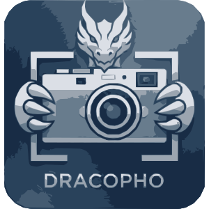

<div align="center">



# dracopho-capture-core

**DracoPho Self-developed Screen Capture Core (Rust)**

A screen capture engine library built on **open standard protocols +
self-written clients** (PipeWire screencast / wlr-screencopy) or self-written
direct capture (X11 XComposite/XGetImage); KDE window-level uses KWin
ScreenShot2 (enabled after relaxing the no-system-service rule, on par with
Spectacle). **Routes each request to the lightest dedicated channel per
desktop**, and lets callers override the routing scheme with parameters.

`MIT OR Apache-2.0` · Rust library (for integration into apps like mark-shot)

Maintained by **Beijing Taiyin Zaowu Technology Co., Ltd. (北京太殷造物科技有限公司)**

</div>

## Features

- **Routing layer (auto-sensing + parameterized)**: `routing::detect_routing()`
  derives the session type and returns the recommended backends plus a
  directly reusable route parameter; `CaptureRequest.route`
  (`RouteMode::Auto/Only/Order/Prefer`) lets callers flexibly switch to a
  specified mode. Each desktop gets its lightest channel: wlroots →
  wlr-screencopy (no portal, no permission), GNOME/KDE → portal ScreenCast
  (the only sanctioned pixel channel), KDE window-level → KWin ScreenShot2
  (silent, precise, zero disturbance), native X11 → XGetImage + XComposite.
- **Never uses portal Screenshot / GNOME screenshot_area**: full/region/record
  go through ScreenCast (PipeWire) or self-written protocols, never popping a
  compositor picker (KDE window-level uses KWin ScreenShot2 — equally silent).
- **Multiple capture modes**: full screen / region / **multi-screen (set, one
  image per screen via `capture_outputs`)** / cross-screen combined (X11) /
  multiple windows / process / window component sub-region.
- **Authorize once, silent forever**: ScreenCast authorization is persisted via
  restore tokens (auto-rotated when the portal rotates them), reused across
  processes and reboots — no repeated authorization dialogs. In headless mode
  the token is **silently re-validated
  against the portal permission store before any `Start` call**, so a stale or
  revoked token fails fast with a clear error instead of popping the compositor
  picker. The preflight (`auth::verify_saved_token`) runs automatically inside
  the library and can also be called by the host application.
- **Headless rule**: never creates windows, never pops dialogs, never disturbs
  other user processes.
- **Streaming capture**: pull frames repeatedly (scroll capture) with frame
  timestamps, stale-frame filtering, and FPS throttling (recording).
- **Monitor selection (multi-stream)**: uses portal `multiple=true` so each
  selected monitor comes back as its own stream with `position`/`size`; a
  `preferred_output` name is resolved to a geometry and matched against the
  streams (fallback: first stream) — the same interactive screen-picker model
  as GNOME/Ubuntu's screenshot tool, bound to the restore token afterwards.
- **Output enumeration**: self-developed `wl_output` v4 client on Wayland
  (name + logical geometry) and XRandR on X11/XWayland; multi-monitor aware.
- **X11 cursor compositing**: capture includes the pointer (XFixes), no
  reliance on system screenshot.
- **Window enumeration**: X11 self-written / GNOME self-written extension /
  KDE KWin scripting D-Bus (with window UUIDs for ScreenShot2); minimized/
  hidden windows are listed for PID/process targeting.

## Feature Comparison

| Capability | **dracopho-capture-core** | System screenshot services¹ | External tool (grim) | Qt `grabWindow` |
| --- | --- | --- | --- | --- |
| Pure self-developed capture | ✅ | ❌ system service | ✅ (3rd-party) | ✅ (Qt framework) |
| Wayland (GNOME/KDE) | ✅ PipeWire screencast | ✅ portal | ❌ wlr-only | ❌ |
| Wayland wlroots (sway/hyprland/niri) | ✅ wlr-screencopy, no portal | ✅ portal | ✅ | ❌ |
| X11 full/region screen | ✅ self-written XGetImage | ✅ | ✅ | ✅ |
| X11 window own content (occluded/minimized) | ✅ XComposite named pixmap | ❌ | ❌ | ❌ |
| Window / component / multi-window selection | ✅ library API | ❌ | ❌ | ❌ |
| Process (pid/name) target | ✅ | ❌ | ❌ | ❌ |
| Headless silent (no window / no dialog) | ✅ strict | ❌ interactive portal | ✅ | ✅ |
| Authorization once, persistent across reboot | ✅ restore-token persistence | ❌ | n/a | n/a |
| DMABUF GPU frames (EGL import) | ✅ self-written | — | — | — |
| KDE window real content (occluded/minimized) | ✅ KWin ScreenShot2 | ✅ | ❌ | ❌ |
| No portal Screenshot / GNOME screenshot_area | ✅ **hard guarantee** | ❌ | ✅ | ✅ |

¹ xdg-desktop-portal Screenshot / GNOME Shell `screenshot_area` — **not used**
by this project; KDE window-level uses KWin ScreenShot2 (silent channel,
enabled after relaxing the no-system-service rule).

## Hard Rules

- **Never use portal Screenshot / GNOME screenshot_area**; KDE window-level
  uses KWin ScreenShot2 (silent, precise, zero disturbance).
- **Headless mode never pops dialogs**: on missing authorization it exits with
  an error and tells the caller how to authorize — it never triggers a
  compositor picker.
- Minimal channels only: PipeWire (ScreenCast portal + self-written stream
  client), wlr-screencopy-unstable-v1 (self-written client), X11 protocol
  (x11rb), KWin ScreenShot2 (D-Bus, KDE window-level only).

## Backend Matrix

| Backend | Coverage | Notes |
| --- | --- | --- |
| `pipewire-screencast` | GNOME / KDE / any Wayland compositor with ScreenCast portal | Self-written PipeWire client; DMABUF frames imported via self-written EGL (graceful fallback to shared memory without EGL); `multiple=true` multi-stream monitor selection matched by `position`/`size` |
| `wlr-screencopy` | wlroots (sway / hyprland / niri / river…) | Self-written wlr-screencopy protocol client + wl_shm read; no portal, zero dialogs; region capture supported |
| `kwin-screenshot2` | KDE Plasma (window / region / full screen) | Self-written KWin ScreenShot2 D-Bus client (pipe-fd direct pixel read); window-level renders the target window's composited buffer (real content even when occluded/minimized); full/region still prefers portal ScreenCast |
| `x11` | X11 session / XWayland | Self-written XGetImage full/region capture + XComposite named-pixmap window content (occluded/minimized windows included) |

Selection is decided by the routing layer (`routing::detect_routing`):
wlroots → `wlr-screencopy`; GNOME/KDE full/region/record → `pipewire-screencast`
(portal ScreenCast — the only sanctioned pixel channel, includes the
authorization gate); **KDE window-level** → `kwin-screenshot2` (via
`window_object_backends`, real content even when occluded/minimized); native
X11 → `x11`. `CaptureRequest.route` overrides it (`Only` / `Order` / `Prefer`).
`kwin-screenshot2` is never in the default full-screen chain — it cannot be
reached silently without going through the portal authorization first; use
`Only(KwinScreenShot2)` / `Prefer(KwinScreenShot2)` (or the CLI
`--backend kwin-screenshot2`) to explicitly opt into the relaxed KDE rule —
**by design this explicit opt-in skips the portal authorization gate** and is
intended for callers who sanction KWin ScreenShot2 (including headless
region/full-screen via `CaptureArea`/`CaptureWorkspace`).

## Authorization Model (Key)

Wayland compositors (GNOME/KDE) only expose pixels through ScreenCast — **the
first use must be confirmed by the user once**. This library takes it to the
limit:

1. **Interactive authorization** (`allow_interactive_portal=true`, first time
   only) shows the picker once;
2. **Persistent permission**: `persist_mode=EXPLICITLY_REVOKED`, the portal
   stores the permission — survives reboots;
3. **Token persistence**: the library always saves the `restore_token` returned
   by every `Start`. The portal spec describes tokens as single-use with
   rotation, while some frontends (GNOME 50 verified) keep the same token
   valid — either way the authorization chain continues indefinitely (across
   processes and reboots, until the portal permission is revoked);
4. **Resident process holds the session**: the library reuses the PipeWire
   session statically, so later captures in the same process are zero-dialog.

> Headless mode never starts a session on its own; it silently restores only
> while the saved token is valid, otherwise it errors out and asks for
> re-authorization — better to fail than to pop a dialog.
>
> **Silent pre-validation**: before calling portal `Start` in headless mode the
> library queries the portal's own permission store
> (`org.freedesktop.impl.portal.PermissionStore`, table `screencast`) and
> replicates the portal frontend's decision — the token must exist, be granted
> to the caller's resolved `app_id`, carry restore data, and (on GNOME) still
> reference a connected monitor. Any failure aborts **before** `Start`, so a
> stale/revoked token or an unplugged monitor never causes the compositor
> picker to pop up during a background capture.
>
> The preflight is **callable by the library and by the host app alike**: the
> library runs it automatically before a headless `Start`; the host (resident
> tray/daemon) can call `auth::verify_saved_token()` before starting a
> recording to surface "needs re-authorization" up front.

## Library API

The core deliverable is the **Rust library** (`dracopho_capture_core`); the CLI
is only a verification tool.

### Routing: auto-sensing + parameterized override

```rust
use dracopho_capture_core::routing::detect_routing;
use dracopho_capture_core::capture_types::{capture_frame, CaptureRequest, Backend, RouteMode};

// 1) Auto-sense: derive the session type and a recommended routing plan whose
//    `route` field can be assigned straight back into CaptureRequest.
let plan = detect_routing();
println!("session={}", plan.session.name()); // e.g. wayland-gnome / wayland-kde / x11
for b in &plan.recommended { println!("  - {}", b.name()); }

// 2) Pin the sensed routing (or omit it — default Auto re-senses internally).
let req = CaptureRequest {
    route: plan.route.clone(),   // e.g. Order([PipeWireScreencast, X11])
    ..Default::default()
};

// 3) Switch to a specified mode flexibly: Only / Order / Prefer.
let req = CaptureRequest {
    route: RouteMode::Only(Backend::X11),               // X11 only, no fallback
    ..Default::default()
};
let req = CaptureRequest {
    route: RouteMode::Prefer(Backend::KwinScreenShot2), // prefer KDE ScreenShot2, fall back to auto order
    ..Default::default()
};
```

### Screen / region capture

```rust
use dracopho_capture_core::capture_types::{capture_frame, CaptureRequest};

// Full screen (set allow_interactive_portal=true on first integration to
// trigger the one-time authorization)
let req = CaptureRequest {
    source_geometry: None,
    allow_interactive_portal: true, // only first time; false afterwards
    ..Default::default()
};
let result = capture_frame(&req);
if let Some(img) = result.image {
    img.save("screen.png")?;
}

// Region (screen coordinates)
let req = CaptureRequest {
    source_geometry: Some((0, 0, 800, 600)),
    ..Default::default()
};

// Specific monitor by name (Wayland: matched against portal multi-stream
// position/size; X11: XRandR geometry)
let req = CaptureRequest {
    preferred_output: Some("HDMI-1".to_string()),
    ..Default::default()
};
```

### Multi-screen vs cross-screen (never mix the two)

- **Multi-screen selection** (multiple monitors selected) returns a **set of
  images, one per screen — never merged**. Use `capture_outputs`:

```rust
use dracopho_capture_core::capture_types::{capture_outputs, CaptureRequest};

// One image per output, identified by result.output_name. Not stitched.
for c in capture_outputs(&CaptureRequest {
    all_outputs: true,
    ..Default::default()
}) {
    match c.image {
        Some(img) => println!("screen {}: {}x{}", c.output_name.as_deref().unwrap_or("?"),
                              img.width(), img.height()),
        None => eprintln!("screen {} failed: {}", c.output_name.as_deref().unwrap_or("?"),
                          c.error.unwrap_or_default()),
    }
}
```

- **Cross-screen capture** (an explicit `source_geometry` region that spans
  monitors, or X11's whole-virtual-desktop `all_outputs=true`) returns a single
  combined/cropped image (the permitted merge exception). On Wayland the portal
  model has no virtual-desktop stream, so `capture_frame` with `all_outputs=true`
  returns a clear error guiding to `capture_outputs`.

### Window / process / component capture

```rust
use dracopho_capture_core::capture_types::{capture_windows, CaptureRequest};
use dracopho_capture_core::window::{parse_match, WindowMatch};

// Enumerate windows (self-written X11 / self-written GNOME extension)
for (i, w) in dracopho_capture_core::window::list_windows(true).iter().enumerate() {
    println!("[{i}] title={} class={} geo={:?}", w.title, w.class, w.geometry);
}

// Multiple windows (class + title substring + pid, repeatable)
let req = CaptureRequest {
    window_matches: vec![
        WindowMatch::Class("codium".to_string()),
        parse_match("DracoPho", Some("title"))?,
        WindowMatch::Pid(1234),
    ],
    ..Default::default()
};
for c in capture_windows(&req) {
    if let Some(img) = c.image { img.save(format!("{}.png", c.window.title))?; }
}

// Window component sub-region (window-relative coordinates)
let req = CaptureRequest {
    window_matches: vec![parse_match("codium", Some("class"))?],
    component: Some((0, 0, 200, 120)),
    ..Default::default()
};
```

`WindowMatch` supports `Id` / `Title` / `Class` / `Instance` / `Index` / `Pid` /
`Process` (/proc process name) / `Auto`. `parse_match(spec, by)` provides the
selector parsing consistent with C++ `--window-by`.

Full example: `examples/integration_demo.rs`.

## Integration Guide (host app, e.g. mark-shot)

1. **Resident process holds the session**: the library reuses the PipeWire
   session statically. The host app (mark-shot tray/daemon) calls with
   `allow_interactive_portal=true` once on startup; all later captures in the
   same process are **zero-dialog**.
2. **Persistent authorization**: tokens (rotated or kept, per the portal) are stored at
   `~/.config/dracopho-capture-core/screencast-token` (0600), surviving reboots;
   even if the host app restarts, the new process restores silently.
3. **Window content**: X11 uses XComposite (true window content); KDE uses
   KWin ScreenShot2 `CaptureWindow` (by UUID, real content even when
   occluded/minimized); GNOME/Wayland falls back to full-screen frame +
   window-rect crop (occluded-window content may be unreliable;
   `WindowCapture` reports it honestly via `object_capture` / `error` fields).
4. **Scroll capture / recording**: use the streaming API instead of repeated
   single captures:

   ```rust
   use dracopho_capture_core::capture_types::{start_stream, CaptureRequest};

   let stream = start_stream(&CaptureRequest {
       source_geometry: Some((0, 0, 800, 600)),
       target_fps: 15,          // optional FPS throttle (recording)
       ..Default::default()
   })?;
   // Pull the latest frame, skipping frames older than `min_frame_time_ms`
   // (scroll capture hides its own UI, then uses now+delay to skip stale frames).
   while let Some((frame, t)) = stream.next_frame(min_frame_time_ms, 1000)? {
       frame.save("frame.png")?;
   }
   stream.stop();
   ```

   `Stream::next_frame` returns `(RgbaImage, frame_time_ms)`; `target_fps`
   throttles the pull rate and `minimum_frame_time_ms` filters stale frames —
   both are wired into the PipeWire screencast backend.

## CLI (Verification Tool)

```bash
dracopho-capture --list-backends        # list available self-developed backends
dracopho-capture --list-routing         # print the auto-sensed routing plan (session + order + route param)
dracopho-capture --list-windows         # list windows (JSON)
dracopho-capture --list-outputs         # list outputs (wl_output / XRandR)
dracopho-capture --authorize            # interactive authorize once (saves token)
dracopho-capture --capture-to out.png   # headless capture (silent)
dracopho-capture --capture-to out.png --region 0,0,1920,1080 --include-cursor
dracopho-capture --capture-to out.png --output HDMI-1   # capture a specific monitor
dracopho-capture --capture-to out.png --backend x11     # force a route (only): pipewire-screencast|wlr-screencopy|x11|kwin-screenshot2
dracopho-capture --capture-to dir --window VSCodium --window mark-shot \
                 --window-by auto --component 0,0,400,200
```

> The CLI is for verification and debugging; see the API and Integration Guide
> above for the proper library usage.

## Build

```bash
# Dep: libpipewire-0.3 dev (Debian/Ubuntu: apt install libpipewire-0.3-dev)
export PKG_CONFIG_PATH=/path/to/libpipewire/pkgconfig
cargo build --release
cargo test
```

> Build also needs clang/bindgen (libspa-sys binding generation); when missing
> set `LIBCLANG_PATH` and `BINDGEN_EXTRA_CLANG_ARGS` (pointing at clang builtin
> headers).

## Directory Layout

```
src/
  capture_types.rs        public types + backend dispatch (capture_frame / capture_windows / RouteMode)
  routing.rs              routing layer (SessionKind sensing + RoutingPlan + resolve_route)
  window.rs               window enumeration & selection (X11 / GNOME extension / KDE scripting)
  egl_dmabuf.rs           DMABUF EGL import (dlopen, graceful downgrade without EGL)
  auth.rs                 authorization restore-token persistence + headless preflight (verify_restore_token / verify_saved_token)
  output.rs               output enumeration (wl_output v4 / XRandR)
  backend/
    pipewire_screencast.rs  self-written PipeWire client (ScreenCast + EGL import)
    wlr_screencopy.rs       self-written wlr-screencopy client (wl_shm)
    kwin_screenshot2.rs     self-written KWin ScreenShot2 client (D-Bus pipe read; KDE window/region)
    kwin_windows.rs         KDE window enumeration (KWin scripting D-Bus; pure D-Bus, no LGPL)
    x11.rs                  self-written X11 capture (XGetImage + XComposite)
  bin/dracopho_capture.rs CLI verification tool
examples/
  integration_demo.rs     library API integration example
assets/
  TY-DracoPho.svg         project logo (brand asset, copyright reserved)
```

## License

**`MIT OR Apache-2.0`** dual license (see `LICENSE`): integrators may choose
either, and may freely embed the library into their own applications (including
closed-source commercial ones), only keeping the copyright notice.

**Brand & logo reserved**: `assets/TY-DracoPho.svg` and the "DracoPho" /
"太殷龙摄" names and trademarks belong to the DracoPho project
(北京太殷造物科技有限公司). They are **not** granted by the license above and must
not be used for products or promotions unrelated to this project.

---

Copyright © 2026 Beijing Taiyin Zaowu Technology Co., Ltd.
