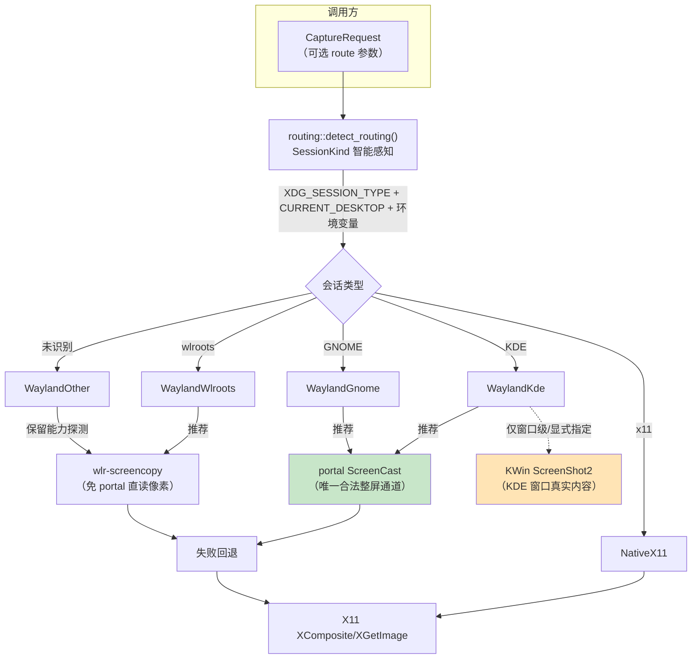
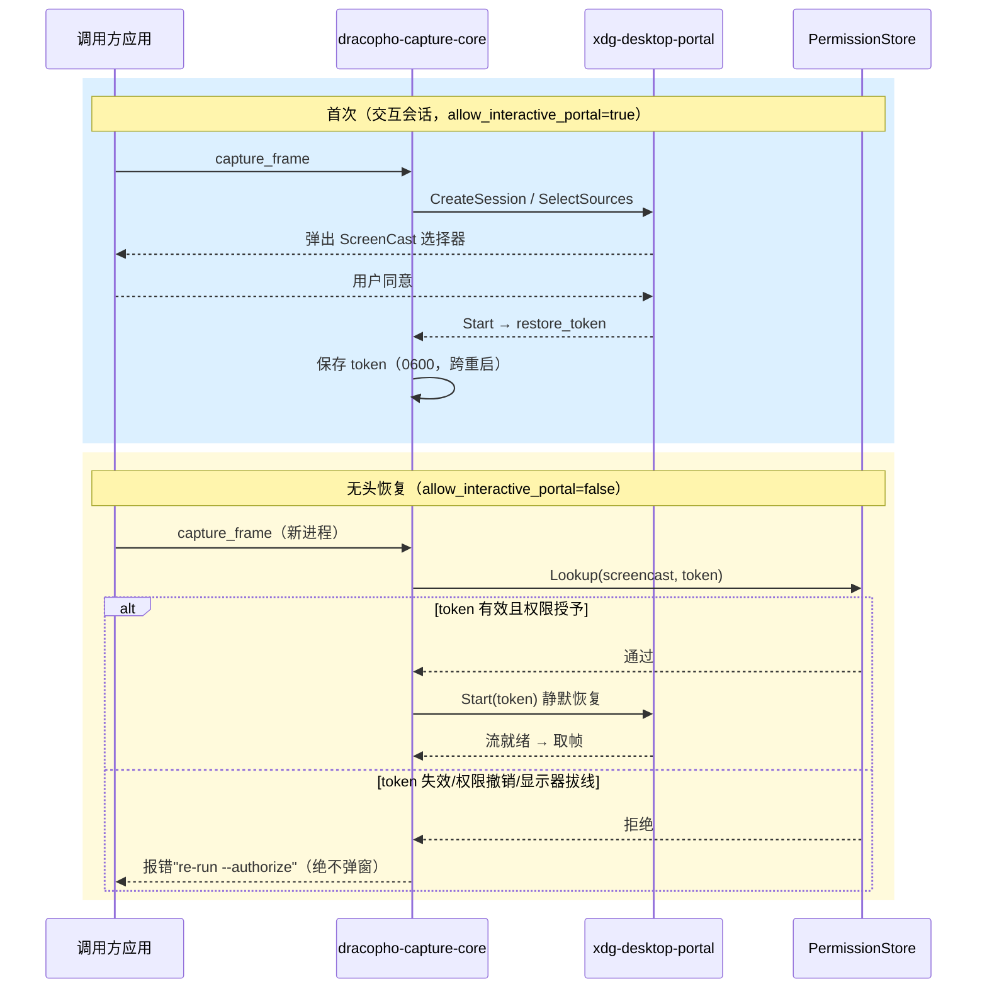

# 01 — 架构与设计

> dracopho-capture-core 的核心架构、路由层、授权模型与捕获语义。

## 1. 设计原则：轻量专用通道 + 路由层

核心原则一句话：**没有一条万能重管道，只有一组"最轻专用通道" + 按桌面
分发的路由层**。

| 场景 | 通道 | 为什么最轻 |
| --- | --- | --- |
| wlroots（sway/hyprland/niri） | 自研 wlr-screencopy 客户端 | 免 portal、免授权、免 PipeWire，直接协议读像素 |
| GNOME/KDE 整屏/区域/流式 | portal ScreenCast + 自研 PipeWire 客户端 | 唯一合法像素通道；一次授权后永久静默（预检已做） |
| 原生 X11 | XGetImage + XComposite | 零授权、窗口级真实内容 |
| KDE 窗口级 | KWin ScreenShot2（铁律放宽后启用） | 静默、精确、零干扰（对标 Spectacle） |

**不做的事**：不引入 GStreamer（直接用 libpipewire）、不用 Qt 抓屏、不依赖
grim/外部进程、不碰 root/DRM 直读。

### 1.1 路由架构总览



核心：**每桌面只用最轻专用通道**；KWin ScreenShot2 仅用于窗口级或显式
`Only/Prefer` 指定（避免绕过 portal 授权静默抓整屏）。

## 2. 路由层（src/routing.rs）

### 2.1 SessionKind 智能感知

`detect_routing()` 按环境变量识别会话类型：

| 判定 | 依据 |
| --- | --- |
| `WaylandWlroots` | `SWAYSOCK`/`HYPRLAND_INSTANCE_SIGNATURE`/`NIRI_SOCKET`/… 或 `XDG_CURRENT_DESKTOP` 命中 |
| `WaylandKde` | `XDG_CURRENT_DESKTOP` 含 kde/plasma 或 `KDE_SESSION_VERSION` |
| `WaylandGnome` | `XDG_CURRENT_DESKTOP` 含 gnome |
| `WaylandOther` | Wayland 但未识别（保留能力探测，不丢通道） |
| `NativeX11` | `XDG_SESSION_TYPE=x11` 或无 type 但有 DISPLAY |
| `Unknown` | 均不满足 |

### 2.2 RoutingPlan 返回路由参数

```rust
pub struct RoutingPlan {
    pub session: SessionKind,          // 识别结果
    pub recommended: Vec<Backend>,     // 推荐后端（已做能力过滤）
    pub route: RouteMode,              // 可直接回填 CaptureRequest.route
    pub notes: Vec<String>,            // 说明（如 XWayland 存在）
}
```

调用方二选一：
- **默认**：不设 `route`（`RouteMode::Auto` 内部自动感知）；
- **参数化**：`plan.route` 赋给 `CaptureRequest.route` 固化方案，或用
  `Only`/`Order`/`Prefer` 灵活指定。

### 2.3 RouteMode 语义

| 模式 | 行为 |
| --- | --- |
| `Auto` | 按桌面智能分发（默认） |
| `Only(b)` | 仅用 `b`，失败不回退（零感知开销） |
| `Order(v)` | 显式回退链（零感知开销） |
| `Prefer(b)` | `b` 在前，失败按自动推荐顺序补齐 |

### 2.4 授权门（KDE 整屏 vs 窗口级）

KDE `Auto` 整屏路由**只含 portal ScreenCast**（`[PipeWireScreencast, X11]`），
`KwinScreenShot2` 不在其中——避免绕过 portal 授权静默抓整屏。ScreenShot2 仅
在**窗口级**（`window_object_backends`）或调用方显式 `Only`/`Prefer` 时启用
（README 已声明该放宽语义）。

## 3. 授权模型

### 3.1 授权一次、永久静默

1. **交互授权**（`allow_interactive_portal=true`，首次）弹一次选择器；
2. **持久化授权**：`persist_mode=EXPLICITLY_REVOKED`，portal 存权限，跨重启；
3. **token 持久化**：始终保存 Start 返回的 `restore_token`（轮换或保持均兼容）；
4. **常驻进程持有会话**：库内静态复用 PipeWire 会话，同进程后续零弹窗。

### 3.2 无头预检（auth.rs）

无头 `Start` 前查询 portal 权限存储
（`org.freedesktop.impl.portal.PermissionStore`，表 `screencast`），复刻前端
判定：token 存在、权限授予解析出的 `app_id`、带恢复数据、GNOME 下引用的
显示器仍在线。

- `Ok(true)` → 正常静默恢复；
- `Ok(false)` → 立即失败（绝不调用会弹选择器的 Start）；
- `Err`（预检本身失败，DBus/解析问题）→ 退化为带 10s 防线的一次 Start 尝试
  （宁可短暂失败，也不因预检误判卡死正常部署）。

预检同时暴露为 `auth::verify_saved_token()`，调用程序可主动调用
（如录制启动前）。

### 3.3 授权时序（交互 → 持久化 → 无头恢复）



预检（PermissionStore 查询）在无头 `Start` **之前**执行，从机制上保证
失效 token 绝不会触发合成器选择器。

## 4. 捕获语义

### 4.1 多屏幕 vs 跨屏幕（严禁混淆）

| 场景 | API | 结果 |
| --- | --- | --- |
| 多屏幕选择 | `capture_outputs` | **每屏一张图，绝不拼接**（`output_name` 标识屏幕） |
| 跨屏幕区域 | `capture_frame(source_geometry)` | 单张组合/裁剪图（允许的例外） |
| X11 整虚拟桌面 | `capture_frame(all_outputs=true)` | 单张组合图（X11 原生支持） |
| Wayland `all_outputs=true` | `capture_frame` | 明确报错并引导用 `capture_outputs` |

### 4.2 窗口对象抓取

`capture_window_object_content` 按路由尝试：
- KDE（ScreenShot2 可用）：`[KwinScreenShot2, X11]`——UUID 走 CaptureWindow，
  XWayland 窗口经 `bridge_x11_ids` 换成 `0x…` XID 走 XComposite；
- 其余：`[X11]`（XComposite，遮挡/最小化真实内容）。

`WindowCapture.object_capture` 如实上报是否拿到对象级内容（false = 区域回退）。

## 5. 文件结构

```
src/
  capture_types.rs        公共类型 + 分发（capture_frame/capture_outputs/capture_windows/RouteMode）
  routing.rs              路由层（SessionKind 感知 + RoutingPlan + resolve_route）
  window.rs               窗口枚举/选择（X11/GNOME 扩展/KDE scripting + X11 id 桥接）
  egl_dmabuf.rs           DMABUF EGL 导入（dlopen，缺 EGL 优雅降级）
  auth.rs                 授权 token 持久化 + 无头预检（verify_restore_token/verify_saved_token）
  output.rs               输出枚举（wl_output v4 / XRandR）
  backend/
    pipewire_screencast.rs 自研 PipeWire 客户端（ScreenCast + EGL 导入）
    wlr_screencopy.rs      自研 wlr-screencopy 客户端（wl_shm）
    kwin_screenshot2.rs    自研 KWin ScreenShot2 客户端（DBus 管道直读）
    kwin_windows.rs        KDE 窗口枚举（KWin scripting D-Bus，async zbus + tokio）
    x11.rs                 自研 X11 抓取（XGetImage + XComposite）
```

## 6. 关键工程决策

| 决策 | 原因 |
| --- | --- |
| zbus 统一 `tokio` feature | ashpd 默认启用 zbus/tokio；混用 async-io 会因无 reactor panic |
| `kwin_windows` async + `Runtime::block_on` | object_server 需 tokio runtime 上下文才能 spawn |
| `#[zbus(name = "result")]` | zbus 默认把方法名转 PascalCase（result→Result），KWin 脚本以小写调用 |
| KWin 5/6 脚本兼容 | KWin 6 用 `stackingOrder`，KWin 5 用 `windowList()/clientList()`；internalId 在 KWin 6 是 QUuid 对象需 toString |
| XWayland id 桥接 | KWin scripting 只给 UUID；X11 窗口需 `0x…` XID 才能走 XComposite 回退 |
| 私有一次性脚本 | `XDG_RUNTIME_DIR` + 0o700 目录 + O_EXCL/0o600 文件，防符号链接劫持 |
| 回调防注入 | 随机 token 路径 + `#[zbus(header)]` 发送者校验（仅接受 KWin 属主） |
