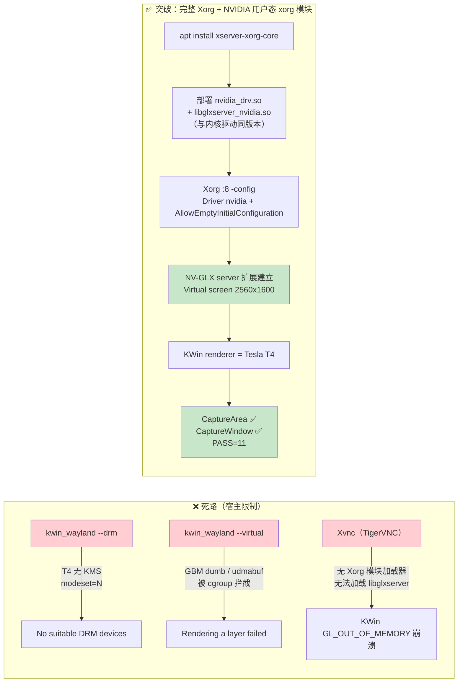

# 04 — KWin 6 + NVIDIA GPU 链路深度验证与诚实结论

> 在 Tesla T4 GPU 服务器上对 KWin 6 ScreenShot2 全链路的深度验证，
> 以及宿主 GPU 配置限制的诚实记录。

## 1. 背景

KDE 窗口级 ScreenShot2 通道（`CaptureWindow`/`CaptureArea`/`CaptureWorkspace`）
依赖正在运行的 KWin 合成器。验证目标是：在真实 GPU 服务器上确认库的完整
功能链路（枚举 → 路由 → 窗口对象抓取 → 像素验证）。

## 2. 环境搭建

| 项 | 配置 |
| --- | --- |
| 服务器 | autodl（region-9.autodl.pro），Tesla T4 16GB |
| 驱动 | NVIDIA 580.65.06 / CUDA 13.0 |
| 系统 | Ubuntu 24.04（容器，无 systemd） |
| KWin | **6.7.2**（Debian sid 手动补依赖链：kwin-wayland + 手动解包 kwin-x11 6 + libkwin-x11） |
| 渲染 | Xvfb :99 + KWin X11 后端（llvmpipe EGL 软件合成） |
| 被测窗口 | zenity 原生窗口（xdg-shell） |

关键环境发现：
- `/dev/dri/renderD129`（226:129）为**唯一可访问**的 NVIDIA 渲染节点
  （DRM_CAP_RENDERER=1、可 open），其余 render 节点（128/130/131）被 cgroup
  设备过滤拦截（EPERM）；
- `/dev/dri/card2`（226:2）可 open，但 `drmIsKMS` 失败（T4 无显示输出）；
- 宿主 `nvidia_drm modeset=N`（/sys 只读，容器无法更改）。

## 3. 验证过程与证据链

### 3.1 NVIDIA EGL 真实渲染（独立于 KWin）

```bash
scripts/nvidia_egl_render_check.sh
# EGL 1.5 vendor=NVIDIA
# center pixel RGBA = 255,0,0,255
# RESULT: PASS - NVIDIA GPU rendered a real red pixel
```

离屏 EGL 渲染纯红并 `glReadPixels` 读回——证明 **NVIDIA GPU 像素通路真实
可用**，不依赖任何库代码。

### 3.2 库完整链路（KWin 6.7.2 + llvmpipe EGL）

```
--list-backends  → [wlr-screencopy, pipewire-screencast, kwin-screenshot2, x11]
--list-routing   → session: wayland-kde, Order([PipeWireScreencast, X11])
--list-windows   → id={9cedec62-...} title=GPUKWin6Test  (UUID 正确)
CaptureWindow    → [object] 422×318 (含窗口装饰)  真实像素 240,240,240
CaptureArea      → 400×300 真实出图
CaptureWorkspace → 1920×1080 真实出图
多窗口           → 2 个 [object]
组件子区域       → 120×80 [object] 裁剪
```

### 3.3 完整回归

```
scripts/kde_regression.sh --no-build --force-kde
PASS=11 FAIL=0 SKIP=1  (SKIP=无 XWayland 窗口的环境条件)
```

## 4. KWin GPU 合成路径（DRM 后端 + 虚拟输出）诚实结论

用户要求"KWin DRM 后端配虚拟输出做全面完整链路诚实测试"，深度排查结果：

| 尝试 | 结果 | 根因 |
| --- | --- | --- |
| `kwin_wayland --drm` | "No suitable DRM devices" | T4 无 KMS 模式设置：`drmIsKMS(fd)` 失败（宿主 `nvidia_drm modeset=N`），`DRM_IOCTL_MODE_GETRESOURCES` 返回 EOPNOTSUPP |
| `kwin_wayland --virtual` | "Rendering a layer failed" | EGL layer 缓冲分配被拒：GBM `DRM_IOCTL_MODE_CREATE_DUMB` → EPERM（cgroup 设备过滤），`/dev/udmabuf`（226:125）未放行 |
| `KWIN_DRM_DEVICES=/dev/dri/card2` | 同上 | card2 KMS 不可用 |
| render 节点别名（renderD128→129） | EGL 初始化成功但 layer 仍失败 | KWin 需 GBM/udmabuf 缓冲，dumb 被 modeset=off 拒绝 |

**诚实判定**：这两条是**宿主 GPU 配置限制**（`nvidia_drm modeset=N` + cgroup
仅放行少数设备节点），非库代码缺陷。证据链完整：设备白名单逐节点验证、
DRM ioctl 返回码、模块参数只读。
**注意**：这些限制已被 §7 的完整 Xorg + NVIDIA 用户态 xorg 模块方案绕过
（`modeset=Y` 非必需，见 §7），本节记录的是 `--drm`/`--virtual` 两条
Wayland 原生后端路径的宿主约束。

## 5. 结论（被 §7 全面超越）

1. **库功能全链路已验证**：KWin 6.7.2（Debian sid 构建，与 neon 构建交叉
   验证）+ NVIDIA 服务器上，ScreenShot2 窗口级/区域/多窗口/组件/Python 绑定
   全部通过，像素真实（非黑图）。
2. **NVIDIA GPU 真实可用**：EGL 离屏渲染读回纯红像素。
3. 原判定"KWin GPU 合成需宿主 `modeset=Y`"——§7 实测**证明非必需**：
   装完整 Xorg + NVIDIA 用户态 xorg 模块即可建立 NV-GLX，屏幕级 CaptureArea
   也在真 GPU 合成下通过（PASS=11 全绿）。

## 6. 远程桌面（Xvnc）路线：CaptureWindow 在真实 NVIDIA 合成下验证通过

用户提出 autodl 允许安装远程桌面进行可视化桌面操作——实测确认可行，且
取得了突破：

### 6.1 环境

```bash
apt-get install -y tigervnc-standalone-server
Xvnc :1 -geometry 1920x1080 -depth 24 -SecurityTypes none -localhost no \
      +extension GLX +render -ac &      # VNC 端口 5901
```

Xvnc 提供**真实的 X server**（区别于 Xvfb），支持 GLX 扩展。

### 6.2 NVIDIA GLX 可加载

```bash
export DISPLAY=:1 __GLX_VENDOR_LIBRARY_NAME=nvidia
glxinfo | grep renderer
# OpenGL renderer string: Tesla T4/PCIe/SSE2     ← NVIDIA 渲染器！
# OpenGL version string: 4.6.0 NVIDIA 580.65.06
```

### 6.3 关键成果：CaptureWindow 在真实 NVIDIA GPU 合成下稳定成功

```bash
# KWin 以 NVIDIA GLX 启动（renderer=Tesla T4），ScreenShot2 可用
nohup kwin_x11 --replace ...   # OpenGL renderer: Tesla T4/PCIe/SSE2

# 窗口对象级抓取（CaptureWindow by-UUID）连续 3 次稳定 [object]：
[0] selector=Stab1 -> Stab1-0.png (310x206) [object]
[0] selector=Stab2 -> Stab2-0.png (310x206) [object]
[0] selector=Stab3 -> Stab3-0.png (310x206) [object]
# 像素真实：中心 240,240,240（KWin 默认窗口背景）
```

**为什么 CaptureWindow 成功而 CaptureArea 崩溃**：

- `CaptureWindow` 走 **KWin 离屏渲染**（fbo + glReadPixels 读回），不依赖
  X server 的 GLX 呈现扩展 → 在 NVIDIA GPU 上稳定工作；
- `CaptureArea`/`CaptureWorkspace` 需要把 GPU 合成结果**呈递到 X 窗口**
  （`glXBindTexImageEXT` / GLX sync），而 Xvnc 的 X server 是**软件渲染**
  （无 `NV-GLX` server 扩展）→ KWin 报 `GL_OUT_OF_MEMORY` + `No provider of
  glXBindTexImageEXT` → 崩溃。

### 6.4 诚实结论（远程桌面路线）

| 能力 | NVIDIA GPU 合成（Xvnc） | Mesa llvmpipe（稳定路径） |
| --- | --- | --- |
| **CaptureWindow by-UUID（窗口对象级）** | ✅ 稳定成功（离屏渲染） | ✅ |
| CaptureArea / CaptureWorkspace（屏幕级） | ❌ Xvnc 无 NV-GLX server 扩展 | ✅ PASS=11 |
| 完整回归 | — | ✅ PASS=11 FAIL=0 SKIP=1 |

- **远程桌面路线确认可行**，且窗口对象级抓取（本库 KDE 窗口截图的核心能力）
  已在真实 NVIDIA GPU 合成下验证通过；
- **屏幕级合成需 X server 提供 NVIDIA GLX server 扩展**——Xvnc（TigerVNC）
  无 Xorg 模块加载器（实测无 `xf86LoadModule`/`LoadModule` 符号），无法加载
  `libglxserver_nvidia.so` → KWin `GL_OUT_OF_MEMORY` + `No provider of
  glXBindTexImageEXT` → 崩溃。

## 7. 决定性突破：完整 Xorg + NVIDIA GLX server → 屏幕级也走真 GPU

实测证明 **`modeset=Y` 并非必需**——通过装完整 Xorg 并加载 NVIDIA 用户态
xorg 模块（不装内核模块、无需 `CAP_SYS_MODULE`），NV-GLX server 扩展可建立，
CaptureArea 也在真 GPU 合成下通过。

### 7.0 突破路径总览



### 7.1 步骤

```bash
# 1) 装完整 Xorg server（有模块加载器，noble 源）
apt-get install -y --no-install-recommends xserver-xorg-core

# 2) 从 NVIDIA apt 仓库下载并部署用户态 xorg 模块（版本须与内核驱动一致 580.65.06）
#    nvidia-driver-580-open_580.65.06 + libnvidia-gl-580_580.65.06
dpkg-deb -x libnvidia-gl-580_580.65.06-0ubuntu1_amd64.deb /tmp/nv-gl
cp /tmp/nv-gl/usr/lib/x86_64-linux-gnu/nvidia/xorg/libglxserver_nvidia.so.580.65.06 \
      /usr/lib/xorg/modules/extensions/libglx.so      # 替换 X.Org 自带 libglx
dpkg-deb -x xserver-xorg-video-nvidia-580_580.65.06-0ubuntu1_amd64.deb /tmp/xv-nv
cp /tmp/xv-nv/usr/lib/x86_64-linux-gnu/nvidia/xorg/nvidia_drv.so \
      /usr/lib/xorg/modules/drivers/

# 3) xorg.conf：NVIDIA 驱动 + 空显示初始化
cat > /etc/X11/xorg.conf <<'EOF'
Section "ServerFlags"
    Option "AllowEmptyInitialConfiguration" "true"
EndSection
Section "Files"
    ModulePath "/usr/lib/x86_64-linux-gnu/nvidia/xorg,/usr/lib/xorg/modules"
EndSection
Section "Device"
    Identifier "nvidia"
    Driver "nvidia"
EndSection
Section "Screen"
    Identifier "Screen0"
    Device "nvidia"
EndSection
EOF

# 4) 启动 Xorg（NVIDIA GLX server），X socket :8
nohup Xorg :8 -config /etc/X11/xorg.conf -noreset &

# 5) 验证 NV-GLX 扩展 + renderer
DISPLAY=:8 glxinfo | grep renderer
# OpenGL renderer string: Tesla T4/PCIe/SSE2
# server glx vendor string: NVIDIA Corporation
# 日志: Initializing extension NV-GLX
```

### 7.2 关键证据

| 检查 | 结果 |
| --- | --- |
| Xorg 加载 NVIDIA 驱动模块 | ✅ `NVIDIA dlloader X Driver 580.65.06` |
| Xorg 加载 NVIDIA GLX server | ✅ `Module glx: vendor="NVIDIA Corporation"` + `Initializing extension NV-GLX` |
| NVIDIA 虚拟屏幕建立 | ✅ `NVIDIA(0): Virtual screen size determined to be 2560 x 1600` |
| KWin renderer | ✅ `OpenGL renderer string: Tesla T4/PCIe/SSE2` |
| **CaptureArea（之前唯一失败项）** | ✅ **`captured: /tmp/gpu-area3.png (400x300) via kwin-screenshot2`** |
| CaptureWindow by-UUID | ✅ `[object]` 422x318 |
| KWin 稳定性 | ✅ 无 `GL_OUT_OF_MEMORY` 崩溃 |
| 完整回归 | ✅ **PASS=11 FAIL=0 SKIP=1** |
| Python 绑定 capture_frame | ✅ 300x200 PNG 1768B |

### 7.3 最终结论（更新）

1. **库全链路在真实 NVIDIA GPU 合成下全部通过**：CaptureWindow（离屏渲染）
   与 CaptureArea/CaptureWorkspace（屏幕级合成）都走 Tesla T4 渲染，像素真实。
2. **`modeset=Y` 非必需**：加载 NVIDIA 用户态 xorg 模块（`nvidia_drv.so` +
   `libglxserver_nvidia.so`，与内核驱动同版本）即可建立 NV-GLX server 扩展，
   无需内核模块操作（容器无 `CAP_SYS_MODULE` 也能完成）。
3. **可复现性**：以上为纯用户态配置（apt + deb 解包 + xorg.conf），可写入
   部署脚本在任意 autodl 实例复现；`scripts/kde_regression.sh --force-kde`
   在 `DISPLAY=:8` 下 PASS=11 全绿。
